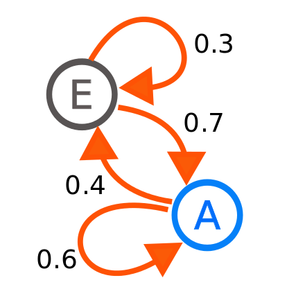

# Generador de frases con cadenas de Markov

## Que es la cadena de Markov
En la teoria de la probabilidad, se conoce como la cadena de Markov a un tipo especial de proceso en el que la probabilidad de que un evento suceda depende solamente del evento anterior.

## Explicación del código
En nuestra función principal, abrimos el fichero de texto sobre el que vamos a leer y llamamos a la función leer_palabras.

### leer_palabras(file)
En esta función, leemos linea por lina nuestro fichero de texto, cambiamos los signos de puntuación por espacios en blanco (función separar_signos), separamos cada palabra y la guardamos en un diccionario.

En ese diccionario, la clave es la palabra que estamos leyendo y su valor son todas las plabras que vienen después de esa en esa misma linea.

### preparar_cadena_Markov(palabras: dict, texto: list)
Aquí, creamos un diccionario que contiene los estados en los que aparece cada palabra, por ejemplo, en la frase "Hola que tal" el estado de Hola es "START START", el estado de que es "START Hola", y el estado de tal es "Hola que". Y además definimos el estado "END" en el que guardaremos el estado de las palabras que finalizan la linea, para distinguir cuando finaliza la frase cuando la construyamos.

### gen_frase(cadena: dict)
Finalmente, con el diccionario generado en la función anterior, tenemos que crear una frase que no exista en el fichero de texto que leemos. para ello hacemos un bucle while hasta que lleguemos al estado "END", y dentro de ese bucle guardamos una palabra elegida al azar entre las distintas posibilidades que tiene ese estado y generamos el siguiente estado que hay que guardar.

Para acabar, después del while, añadimos una palabra al azar de el estado final que le corresponda.